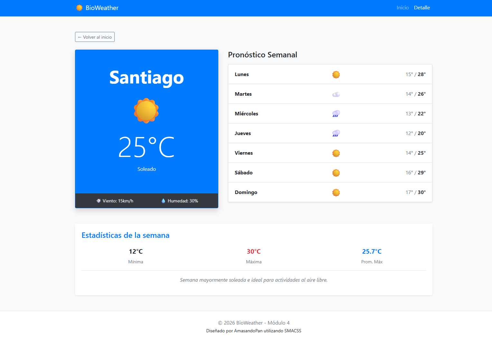

# ☀️ BioWeather - Módulo 4: Lógica y Estadísticas en JavaScript

**BioWeather** es una aplicación web diseñada para visualizar el clima regional de manera dinámica. En esta cuarta iteración, el proyecto evoluciona de una interfaz estática a una aplicación funcional capaz de procesar datos, calcular estadísticas climáticas y generar reportes automáticos mediante JavaScript.

---

## 🚀 Demo en Vivo

Puedes ver el proyecto funcionando aquí:  
👉 **[VER PROYECTO EN GITHUB PAGES](https://amasandopan.github.io/weather-frontend-m4)**

---

## ✨ Características de esta versión (Módulo 4)

- **Gestión Dinámica de Datos:** Los datos han sido migrados a un modelo de objetos en JavaScript, eliminando el contenido "quemado" en el HTML.
- **Cálculos Estadísticos:** La aplicación recorre el pronóstico semanal de cada lugar para calcular:
  - Temperatura mínima absoluta.
  - Temperatura máxima absoluta.
  - Promedio de temperaturas máximas de la semana.
- **Resumen Inteligente:** Generación de mensajes textuales dinámicos basados en la frecuencia de estados climáticos (ej: "Semana mayormente soleada").
- **Persistencia de Selección:** Uso de `localStorage` para comunicar la elección del usuario entre la vista principal y la vista de detalle.
- **Arquitectura Modular:** Mantengo la estructura **SMACSS** para CSS y una separación clara de responsabilidades en los archivos JS.

---

## 🛠️ Tecnologías Utilizadas

- **HTML5 & Bootstrap 4:** Estructura y diseño responsivo.
- **SASS:** Estilos modulares con variables, mixins y metodología BEM.
- **JavaScript (Vanilla ES6+):** \* Uso de ciclos (`for...of`) para procesamiento de datos.
  - Funciones de búsqueda y filtrado (`.find()`, `.forEach()`).
  - Manipulación dinámica del DOM.

---

## 📊 Modelado de Datos

Los datos están organizados en un arreglo de objetos centralizado. Ejemplo de la estructura utilizada:

```javascript

{

id: 1,

nombre: "Santiago",

tempActual: 25,

estadoActual: "Soleado",

pronosticoSemanal: [

{ dia: "Lunes", min: 15, max: 28, estado: "Soleado" },

{ dia: "Martes", min: 14, max: 26, estado: "Nublado" }

// ... total 7 días

 ]
}

```

---

## 📸 Vista Previa



---

## ⚙️ Instalación y Uso Local

Si quieres clonar este proyecto y ejecutarlo en tu máquina local, sigue estos pasos:

1.  **Clona el repositorio:**
    ```bash
    git clone [https://github.com/AmasandoPan/weather-frontend-m4.git]
    ```
2.  **Compilación de SASS:** Asegúrate de tener instalado Live Sass Compiler o similar para procesar `/scss/main.scss` hacia `/css/main.css`.

3.  **Abre el archivo `index.html`** en tu navegador favorito.

---

## 👤 Autor

Desarrollado con ❤️ por **AmasandoPan**.
_Proyecto Clima M4 - 2026_

---

© 2026 BioWeather. Todos los derechos reservados.
